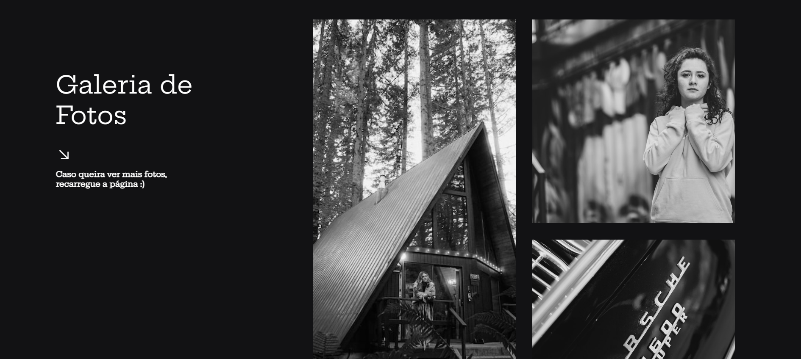

    

## 🖼️ Projeto
Esse é um projeto de uma galeria de fotos.

## 👨🏽‍💻 Tecnologias
Esse projeto foi desenvolvido durante a aula de programação de scripts com as seguintes tecnologias:

- HTML
- CSS
- JavaScript
- jQuery
- jQuery UI
- Bootstrap
## Link do projeto
Você pode visualizar o projeto através [desse link](https://matheuscesaramaral.github.io/Galeria-de-fotos/)
